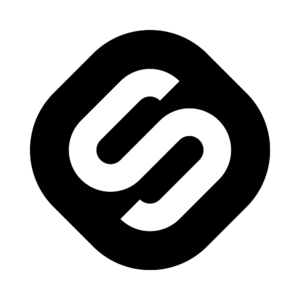
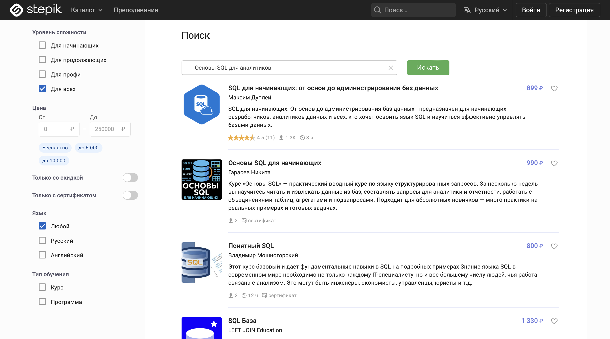

<!-- Improved compatibility of back to top link: See: https://github.com/othneildrew/Best-README-Template/pull/73 -->
<a id="readme-top"></a>
<!--
*** Thanks for checking out this README. If you have a suggestion that would make this better,
*** please fork the repo and create a pull request or simply open an issue with the tag "enhancement".
*** Don't forget to give the project a star!
*** Thanks again! Now go create something AMAZING! :D
-->

<!-- PROJECT LOGO -->
<br />
<div align="center">
  <a href="assets/logo.png">
    
  </a>

  <h3 align="center">Stepik Vector Search</h3>

  <p align="center">
    We build better <a href="https://welcome.stepik.org/ru">Stepik.org</a> Search<br>
    <a href="https://github.com/Innotiative/SearchStepik/blob/main/assets/StepikSearchV0.pdf">Summary of v0</a>
     ·
    <a href="https://github.com/Innotiative/SearchStepik/blob/main/assets/test_tables.pdf">Tests</a>
    ·
    <a href="https://stepik.skillsnavigator.ru/">Try (deployed)</a>
    ·
    <a href="https://github.com/Innotiative/SearchStepik/issues">Report Bug</a>
  </p>
</div>

<!-- TABLE OF CONTENTS -->
## Содержание

<ol>
  <li>
    <a href="#about-the-project">О проекте</a>
    <ul>
      <li><a href="#built-with">Инструменты</a></li>
    </ul>
  </li>
  <li>
    <a href="#getting-started">Запуск проекта</a>
    <ul>
      <li><a href="#no-gpu">Без GPU</a></li>
      <li><a href="#with-gpu">С GPU</a></li>
      <li><a href="#how-to-use">Как пользоваться?</a></li>
    </ul>
  </li>
  <li>
    <a href="#configuration">Настройка</a>
    <ul>
      <li><a href="#frontend-port">Внешний порт фронтенд части</a></li>
      <li><a href="#backend-config">Настройка бэкенда</a></li>
      <li><a href="#qdrant-cleanup">Очистка Qdrant</a></li>
    </ul>
  </li>
  <li><a href="#qdrant">Qdrant</a></li>
  <li><a href="#team-49">Студенческая команда разработки Innotiative</a></li>
  <li><a href="#license">Лицензия</a></li>
  <li><a href="#contact">Контакты</a></li>
</ol>

<!-- ABOUT THE PROJECT -->
<a id="about-the-project"></a>
## О проекте

<a href="assets/screen_SQL.png">
  
</a>

Экспериментируем с векторизацией курсов Stepik.org.
Цель: Разработать справедливую систему векторного поиска, которая помогает миллионам студентов находить качественные курсы, а авторам всех уровней — получать честные возможности для роста.

**Наши принципы:**
- **Многостороннее балансирование интересов**
- **Справедливое ранжирование с защитой от манипуляций**
- **Поддержка новых авторов и контента**
- **Многофакторная оценка образовательного качества**
- **Разнообразие против концентрации популярности**
- **Непрерывное обучение на основе обратной связи**

<p align="right">(<a href="#readme-top">back to top</a>)</p>

<a id="built-with"></a>
### Инструменты

Мы строим поиск на:

[![FastAPI][FastAPI.js]][FastAPI-url]  
[![Qdrant][Qdrant.js]][Qdrant-url]  
[![PyTorch][PyTorch.js]][PyTorch-url]  
[![Hugging Face][Hugging-Face.js]][HuggingFace-url]

<p align="right">(<a href="#readme-top">back to top</a>)</p>

<!-- GETTING STARTED -->
<a id="getting-started"></a>
## Запуск проекта

<a id="no-gpu"></a>
### Без GPU

```
docker-compose -f docker-compose.local.yml up --build
```

<a id="with-gpu"></a>
### С GPU

```
docker-compose -f docker-compose.gpu.local.yml up --build
```

<a id="how-to-use"></a>
### Как пользоваться?

1. **Откройте страницу поиска:**  
   Перейдите по адресу `http://localhost:(ваш порт)` в браузере.
2. **Настройка поиска:**  
   Настройте поиск с помощью весов на странице `http://localhost:(ваш порт)/settings.html`.
3. **Важно:**  
   Настройки не сохраняются после перезагрузки.

<p align="right">(<a href="#readme-top">back to top</a>)</p>

<!-- CONFIGURATION -->
<a id="configuration"></a>
## Настройка

<a id="frontend-port"></a>
### Внешний порт фронтенд части

В `.env` укажите порт для фронтенда:

```
STEPIK_PORT=8080
```

<a id="backend-config"></a>
### Настройка бэкенда

Отредактируйте `backend/app/config.py`:

```
load_courses = False  # Отключить загрузку и векторизацию курсов
embedding_model = "ai-forever/ru-en-RoSBERTa"  # Альтернативная модель
```

<a id="qdrant-cleanup"></a>
### Очистка Qdrant

При смене модели, payload или полей — очистите Qdrant.

<p align="right">(<a href="#readme-top">back to top</a>)</p>

<!-- QDRANT -->
<a id="qdrant"></a>
## Qdrant

Qdrant — векторная база данных проекта.

<p align="right">(<a href="#readme-top">back to top</a>)</p>

<!-- TEAM -->
<a id="team-49"></a>
## Студенческая команда разработки Innotiative

- **Лана Ермолаева** — Team Lead, Product+Project Manager
- **Адиля Сайфетдиарова** — Design
- **Булат Газизов** — Backend + DevOps
- **Иван Ершов** — AI & Vectorisation
- **Артур Попов** — DevOps

<p align="right">(<a href="#readme-top">back to top</a>)</p>

<!-- LICENSE -->
<a id="license"></a>
## Лицензия

MIT License. Подробнее: [LICENSE](https://github.com/Innotiative/SearchStepik/blob/main/LICENSE)

<p align="right">(<a href="#readme-top">back to top</a>)</p>

<!-- CONTACT -->
<a id="contact"></a>
## Контакты

**Innotiative Team Lead** — [@oELYAo](https://t.me/oELYAo) — [ermolanaeva@gmail.com](mailto:ermolanaeva@gmail.com)  
**Project Link:** [https://github.com/Innotiative/SearchStepik](https://github.com/Innotiative/SearchStepik)

<p align="right">(<a href="#readme-top">back to top</a>)</p>

<!-- MARKDOWN LINKS & IMAGES -->
[issues-shield]: https://img.shields.io/github/issues/Innotiative/SearchStepik.svg?style=for-the-badge
[issues-url]: https://github.com/Innotiative/SearchStepik/issues
[license-shield]: https://img.shields.io/badge/License-MIT-yellow.svg?style=for-the-badge
[license-url]: https://github.com/Innotiative/SearchStepik/blob/main/LICENSE
[product-screenshot]: assets/screen_SQL.png
[FastAPI.js]: https://img.shields.io/badge/FastAPI-009688?style=for-the-badge&logo=fastapi&logoColor=white
[FastAPI-url]: https://fastapi.tiangolo.com
[PyTorch.js]: https://img.shields.io/badge/PyTorch-EE4C2C?style=for-the-badge&logo=pytorch&logoColor=white
[PyTorch-url]: https://pytorch.org
[Qdrant.js]: https://img.shields.io/badge/Qdrant-DC143C?style=for-the-badge
[Qdrant-url]: https://qdrant.tech
[Hugging-Face.js]: https://img.shields.io/badge/Hugging_Face-0b0f19?style=for-the-badge&logo=huggingface&logoColor=yellow
[HuggingFace-url]: https://huggingface.co/docs/transformers/index

